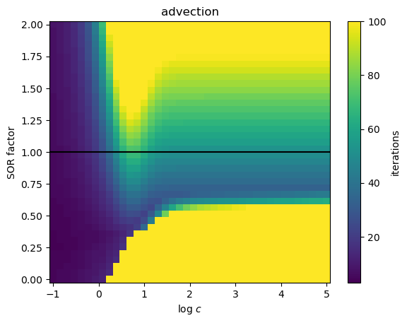
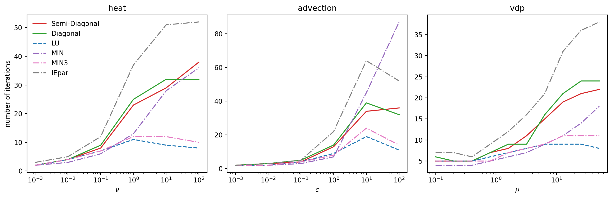
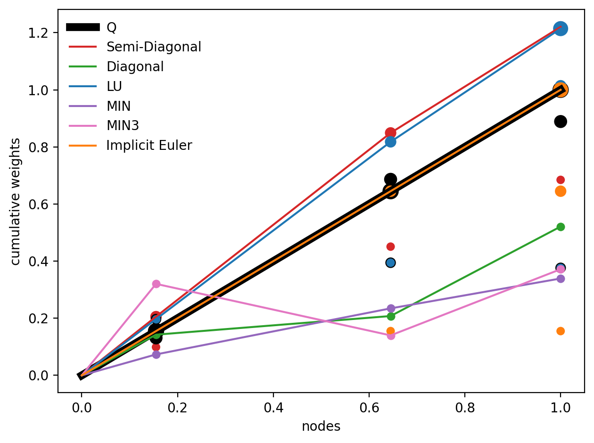
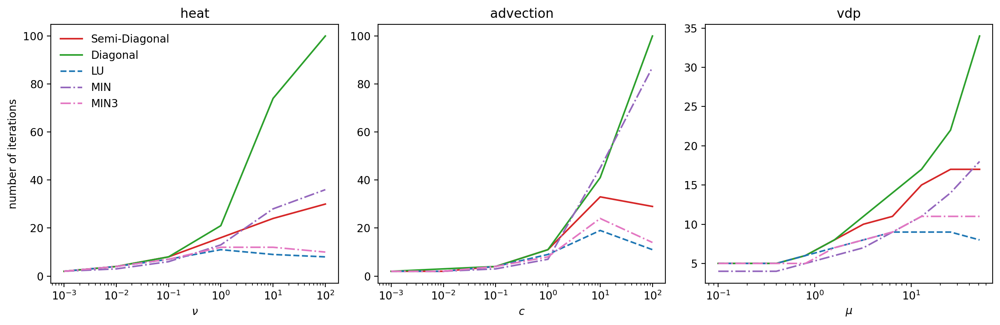

# Successive Over-Relaxation
Since the MIN-preconditioner is essentially parallel implicit Euler, rescaled with smaller step size, we should explore if we can view this in a successive over-relaxation (SOR) context.
The notion comes from solving systems iteratively, where the increment is artificially and problem-specifically increased in order to accellerate convergence.

Let's consider what happens when we do implicit Euler over a different step size than the actual interval.
We start out with the problem that we want to solve, which is the defect equation for the Dahlquist problem, since we want something that is easy to handle.

$$
\delta - \int_0^{\Delta t} \lambda\delta dt = r,
$$
where $\delta$ is the defect, $\lambda$ is the Dahlquist parameter and $r$ is the residual of the collocation problem.

Now, we discretize this with implicit Euler:

$$
\delta - \Delta t \lambda \delta = r \implies \delta = \frac{r}{1-\Delta t \lambda}
$$

We can consider a second solution $\delta'$ to the problem with a different step size, which we call $\Delta t'$:

$$
\delta' = \frac{r}{1-\Delta t' \lambda}.
$$

Keep in mind that we are still solving the defect equation for the collocation problem, which integrates the solution over the step size $\Delta t$.
But considering that implicit Euler corresponds to a first order polynomial interpolation, it is not unreasonable to challenge the notion that we need to compute the defect over the same interval as the solution.
All we are doing when we change that is increase or decrease the slope of our first order polynomial.
Now we are entering thin ice, because this is not generally a good idea, but the well-established concept of successive over-relaxation shows that employing such techniques is not at all uncharted territory.
On the contrary; if you know your problem well, you can greatly accelerate convergence of iterative schemes by tinkering with the increment beyond what is generally applicable.

Now how can we influence the size of the increment by the choice of step size $\Delta t'$ for the preconditioner relative to the step size $\Delta t$ of the collocation problem?
Let's just take the ratio!

$$
\frac{\delta'}{\delta} = \frac{1 - \Delta t' \lambda}{1 - \Delta t \lambda} = \frac{\frac{1}{\Delta t \lambda} - x}{\frac{1}{\Delta t \lambda} - 1},
$$

with $x=\Delta t'/\Delta t \ge 0$ the ratio between the step sizes.
We can see that the behaviour depends on the Dahlquist parameter $t\lambda$, and we need to be carefull not to change the sign of the correction, which would leed to divergence.

## Tests with advection
Since plotting is easier than thinking, let's make an experiment before we commit any more energy to strenuous contemplations.

<em>Iteration counts for diagonal implicit Euler for the advection problem for several advection speeds and over-relaxation parameters, which correspond to x in the previous discussions.
Evidently, smaller step sizes for the preconditioner compared to the collocation method yield faster convergence for stiff problems.
100 iterations was the maximium allowed, so yellow regions mark non-convergence.
The horizontal line marks regular implicit Euler with no SOR applied.
</em>

We can read off that $x\approx0.7$ seems like a good guess.
Performing a similar plot with parallel Crank-Nicholson yields $x\approx 1.3$, since everything is shifted by a factor of 2, due to the factor in the basic Crank-Nicholson rule.
I cannot offer an explanation as to the precise shapes visible in the plots, in particular the saw-tooth coming from the top or why the Crank-Nicholson version is just a rescaled version of the implicit Euler one, but I think this is highly interesting.
Possibly, the tooth emerges as a a consequence of periodic non-convergence areas on the imaginary axis for most preconditioners.

Anyways, we can make plots showing how well the successive over-relaxation versions of the preconditioners can cope with stiff problems.

<em>Plots showing the ability of successive over-relaxation versions of preconditioners to handle stiff problems.
Diagonal corresponds to parallel implicit Euler integrating over 0.7 times the collocation step size.
Semi-diagonal corresponds to parallel Crank-Nicholson integrating oer 1.3 times the collocation step size.
Evidently, the successive over-relaxation version of parallel implicit Euler beats regular parallel implicit Euler by a factor of about two. 
</em>

Clearly, we can significantly improve the performance of parallel implicit Euler using successive over-relaxation.
Of course, parallel implicit Euler is not a particularly competitive preconditioner to begin with, but this suggests that serial preconditioners might be improved as well by like strategies.

Another noteworthy observation emerges when considering that successive over-relaxation is highly problem dependent.
We eye-balled an ideal factor for the advection problem from a previous plot and it turned out to improve performance for all equations considered here by about the same amount.
Again, I cannot offer an expaination as of now, but only remark that it is certainly an interesting feature.

## Using this with optimization
Of course, the point of this exersize was to gain insight into preconsitioners which can be applied to the optimization using adaptivity.
One way we can make use of this, is to use the SOR preconditioners as initial conditions for the optimization.

<em>Weights of the optimization obtained preconditioners when using SOR based initial conditions.
Interestingly, the step size ration of the semi-diagonal one is decreased to the same ratio as the LU preconditioner has and the shape of diagonal preconditioner is diverging from parallel Euler to something loosely resembling the MIN3 preconsitioner.
</em>

Let's see how these new preconditioners fare with stiff problems.

<em>Plots showing the ability of optimization obtained preconditioners when using SOR based initial conditions to handle stiff problems.
The diagonal preconditioner is diverging for stiff problems and not very competitive for moderately stiff ones, whereas the semi-diagonal one slightly outperforms its initial conditions. 
</em>

