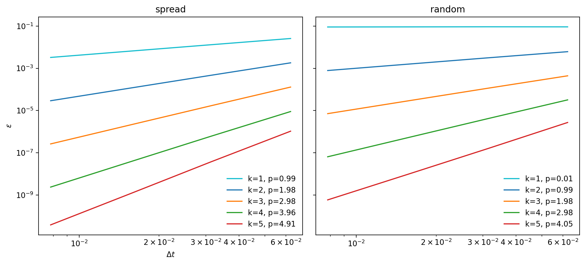

# Adaptivity With Strange Preconditioners

Adaptivity requires an update-rule for the step size, which requires knowing the order of the scheme in order to connect the step size to the error estimate.
When we choose implicit Euler as the preconditioner, no matter if parallel or serial, all is good.
We are solving the defect equation to first order, such that we gain an order of accuracy in each sweep as long as we are not running into limitations dictated by stiffness or the collocation method.

What happens when we forget about time-stepping for a minute and treat the collocation problem as a (linear) algebra problem?
We have seen that things like the LU or the MIN3 preconditioner can accelerate convergence compared to our trusty old Euler, but their range of convergence is limited.
Because we use the residual on the right hand side of the error equation, we will still gain a meaningfull correction, pretty much no matter what, but we are not guearanteed the desired convergence properties with these preconditioners.
To see that, let's plot the order of accuracy twice with an LU preconditioner and the only thing that we change is the initial guess, a.k.a. the numbers we use to initialize the quadrature nodes.

<em>Order of global accuracy for SDC with LU preconditioner with different initial guesses.
spread means the initial conditions are copied to the nodes.
When initializing randomly, we lose an order since the linear algebra based correction is not connected to the time-stepping defect enough.
</em>

We can see that the order of the global error is equal to the iteration count when we spread the initial conditions to the nodes, but if we initialize randomly, we lose an order.
Now, in practice one would of course not initialize randomly, but chose a more sensible prediction such as spreading, since the solution is likely to resemble the initial conditions somewhat.
But we can challenge this assumption: What if the solution to the step does not resemble the initial conditions at all?
If we have a chaotic system, for instance, we might end up with an unexpected order.

Upon further investigation, it appears that all preconditioners that we tested which don't offer an interpretation as a quadrature rule, but appear only after interpreting SDC as an algebraic problem, are able to provide convergence only if the initial guess is sufficiently close to the final solution.
On the other hand, trusty friends like implicit Euler, both zero-to-node (diagonal) as well as node-to-node, show convergence no matter the initial guess.
While fixating on quadrature rules as preconditioners in the past seemed like unreasonable fixation on relics from SDCs original introduction, this provides us with at least a minor point in their favor.
In practice, though, we will always chose sensible predictions and are likely to obtain good speedup from LU and like preconditioners.
Hence, we chose to ignore the fact that we might lose an order to poor initial guesses.
